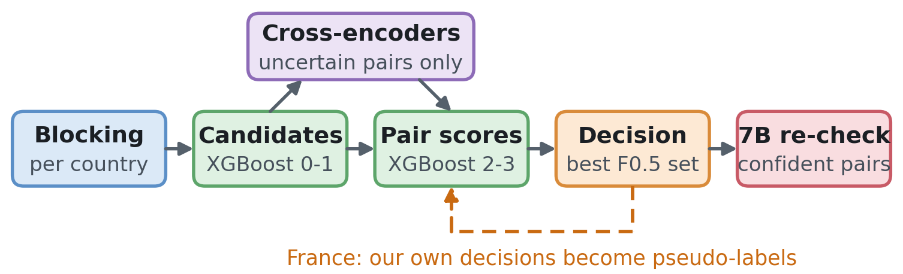
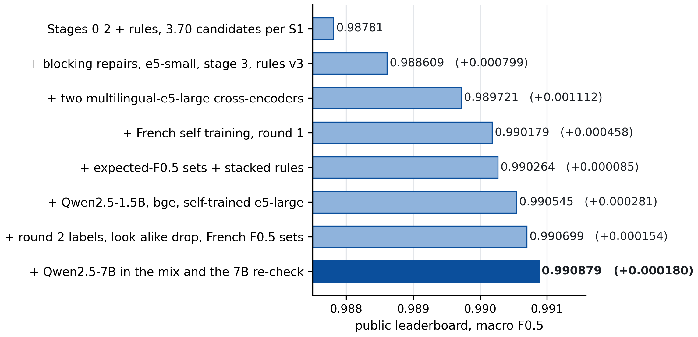

# ML Challenge 2026: Business Entity Resolution Solution Template

**Team Name:** Grenuke  
**Team Members:** Ameya Borkar, Aarush Bakshi, Sachi Dhoka  
**Submission Date:** 29 September 2026

> **At a glance.** **Public leaderboard: 0.990879** macro F0.5, the official score of this package's submission ("Composite B"). **Local validation: 0.9913**, on our labelled US/India holdout (France has no labels). Blocking keeps **99.1%** of true pairs at **3.70 candidates per S1**. Only the provided data; every model is **MIT or Apache-2.0** and **≤ 8B** parameters.

### Contents

- [1. Executive Summary](#1-executive-summary)
- [2. Methodology](#2-methodology)
- [3. Candidate Generation (Blocking)](#3-candidate-generation-blocking)
- [4. Matching Model](#4-matching-model)
- [5. Results & Error Analysis](#5-results--error-analysis)
- [6. Conclusion](#6-conclusion)
- [Appendix A. Code Artefacts](#a-code-artefacts)
- [Appendix B. Additional Results](#b-additional-results)

---

## 1. Executive Summary

*We **retrieve** candidates, **score** every pair, and **decide** for each Source-1 (S1) business which set of Source-2/3 copies maximises the expected F0.5.*

**Blocking** searches each country separately, and a first classifier trims its output to 3.70 candidates per S1. **Gradient-boosted classifiers** (XGBoost) then score each pair on name, address and legal-form evidence. For the pairs those classifiers are unsure about, fine-tuned multilingual **cross-encoders** read the text itself: e5, bge, and LoRA-tuned **Qwen2.5-1.5B and 7B**. A **set-level decision** finally chooses, for every S1, the copies that maximise expected F0.5 (Figure 1).

The hardest part was **France**, which appears only in the test set. We taught the models French through **guarded self-training** on our own decisions, and an **independent Qwen2.5-7B re-check** of the predictions that looked certain removed French look-alike decoys that string features accept.

*Figure 1. The pipeline, from records (left) to matches (right). The dashed loop is the French self-training (§2.2).*

---

## 2. Methodology

*Three properties of the data shaped the design: a precision-heavy metric scored per S1, look-alike decoys, and a country without labels.*

### 2.1 Problem Analysis

**A precision-heavy, per-S1 metric.** Each S1 business has 0–11 noisy vendor copies, 3.46 on average. About 5.6% have none, and for those any prediction scores 0. F0.5 weighs precision twice as much as recall, so **a wrong merge costs more than a missed copy**. We therefore designed for precision first, and we decide on each S1's **whole set** rather than pair by pair.

**How copies differ.** On labelled pairs, true copies:
- change case and accents;
- drop or reformat **legal forms** (LLC, Pvt Ltd; SARL/SAS/EURL in about 23% of French copies);
- reorder or append words;
- contain **acronyms**, typos and garbles;
- abbreviate **street types** (Rue → R.) or reorder the address;
- change the **house number**, or leave the address **empty**.

Our blocking keys (§3) and features (§4) are built around exactly these edits.

**Look-alike decoys.** The test set has **about 23% more records per S1** than train, while the number of true matches per S1 stays flat. So the extra records are **decoys**: a business word swapped at the same address, a nudged house number, or the same name somewhere else. Because **46–54% of S1 share their name** with another S1, the address usually decides. So every record is owned by at most one S1, and candidates compete within each S1.

**A country without labels.** France appears only in the test set.
- **Generic names:** city plus category, e.g. "lille club sarl". Each French decoy we removed shares its name with a median of 43 other S1.
- **Shared addresses:** 11% of French S1 share their exact address with another S1.
- **Administrative names:** 32% of French addresses carry department or region names.

Our first uploads scored 0.976–0.980 on the public leaderboard, against 0.984–0.989 on our local US/India holdout. That implied France near 0.93, **so most of our later work targeted France**.

### 2.2 Solution Strategy

**Approach Type:** Hybrid. Multi-view blocking → gradient-boosted pair classifiers → cross-encoders on the uncertain pairs → a set-level decision → rules → an LLM re-check (Figure 1).

**Core Innovation:**

1. **Guarded, cross-fitted self-training for a country without labels.** We pseudo-label French pairs from our best model's final decisions: *positive* if kept with calibrated probability ≥ 0.9, *negative* if rejected with ≤ 0.05, and unlabelled otherwise. **Guards** protect against known failure modes: rule-derived populations override the labels, and empty-address records keep the first round's labels. The labels are **cross-fitted by S1 group**, so no French pair is ever scored by a model that saw its own label. Round 1 added **+0.00046** on the leaderboard; round 2, together with the French decision layers, added **+0.00015**.
2. **A decision that optimises the metric itself.** Instead of one global threshold, each S1 gets the prediction set with the highest **expected F0.5** under calibrated probabilities, found by a small dynamic programme (§4). It beat a tuned threshold on our local holdout by **+0.000048** (95% CI +0.000007 to +0.000091).
3. **An independent second opinion on "certain" predictions.** 94.5% of final predictions have a stage-1 probability above 0.99, so no cross-encoder ever read them. A LoRA-tuned **Qwen2.5-7B** re-reads them and drops those it rejects strongly (logit < −6), a cut-off we fixed on labelled data beforehand. It removed **840 French predictions**; on labelled data, only 8% of such rejects are true matches.

**How we decided what to keep.** For US/India, our **local validation** is a **fixed holdout of 25% of train S1** (549,699 S1). It was never used for fitting, and we scored it with the official macro F0.5. A component was kept only if a **paired bootstrap** showed a gain, with ties going to the simpler option. Post-hoc rules also had to gain on **both halves** of the holdout. France has no labels, so we judged it with label-free checks, estimates corrected with the 7B's judgement, and leaderboard probes that changed only France.

---

## 3. Candidate Generation (Blocking)

*Blocking keeps 99.1% of true pairs while cutting the search to 3.70 candidates per S1.*

**Blocking keys used.** Every search runs **per country**, so IDF weights and neighbours are never borrowed across countries. Records with an empty country join every partition. Three complementary views each catch a different kind of noise (Table 1).

*Table 1. Blocking views.*

| view | how it matches | what it catches |
|---|---|---|
| **Token view** | IDF-weighted token overlap on name + address, searched both ways (each S1's top 40 records, each record's top 8 S1). A pair is kept if it ranks in the S1's top 15 or the record's top 4 | most copies. A (house number, street word) key that skips street types handles French addresses |
| **Names-only view** | character 4-grams; single-token names of 8+ letters | empty or short addresses, garbles, domains and handles |
| **Repairs** | domain names split into the country's words; OCR digits in names fixed; an Indic→Latin dictionary (693 entries) learned from training pairs | web-style names, OCR errors, transliterated names |

**Candidate pairs generated.** Retrieval yields **58.4M test pairs** (66.4M train). A stage-0/1 gradient-boosted scorer then keeps the pairs with **p1 ≥ 0.02**, plus each record's **two highest-scoring S1**, and acronym joins are added. That leaves **6,410,308 candidates, or 3.70 per test S1** (`candidate_pairs.tsv`).

**How you ensured true matches were not lost.** We **measured blocking recall on the local holdout** rather than assuming it. **99.1%** of true pairs are candidates; the 16.5k misses (of about 1.9M) are mostly empty-address copies whose name changed. Tighter candidate cuts lost holdout F0.5 (top-1 per record −0.000106; p1 ≥ 0.05 −0.000041), so we kept the more generous cut.

---

## 4. Matching Model

*Four XGBoost stages score each pair, cross-encoders read the uncertain ones, and a per-S1 decision picks the final set.*

**Features used.** All statistics are fitted per country; there is no country feature. Table 2 groups the features by the evidence they measure.

*Table 2. Feature groups.*

| group | main features | why they matter |
|---|---|---|
| **Name** | fuzzy ratios (token-sort, token-set, partial, Jaro-Winkler); token Jaccard and containment; IDF-weighted cosine; legal-form agreement; counts of unexplained tokens; learned look-alike word odds | copies keep the name's rare words, while decoys swap one business word |
| **Address & house number** | house-number equality, nudges (±1–10), digit edits and suffixes; street overlap; city and state; whole-address similarity; empty and PO-box flags | the address separates businesses that share a name |
| **Context** | rank in each blocking view; the gap to the S1's best candidate and to rival S1; name-collision counts; per-S1 aggregates; cluster support; the cross-encoder score | a pair is judged against its competitors |

**Model type.** Four **XGBoost** stages, each trained out-of-fold over three S1 groups so that later stages learn from honest scores. **Stage 0** prunes about 80% of pairs cheaply. **Stage 1** gives the probability p1, which sets the candidate cut and the uncertain band. **Stage 2** adds the cross-encoder, per-S1 and cluster features and the French pseudo-labels, and is isotonic-calibrated. **Stage 3** re-scores each pair in the context of its S1's other candidates.

**The cross-encoders** read only the **uncertain band**, 0.02 ≤ p1 ≤ 0.99 (1.49M test pairs), because that's where reading the text pays off. Each is trained as three out-of-fold models on `name ; address` of both records, up to 96 tokens. Their z-scored scores are **averaged into one stage-2 feature**: separate scores let stage 2 extrapolate where the models disagree, which happens four times as often in France. Table 3 lists the models.

*Table 3. Cross-encoders (band AUC on labelled local-holdout pairs; stage-1 p1 alone scores 0.930).*

| model | size | licence | training | band AUC |
|---|---|---|---|---|
| multilingual-e5-small / e5-large | 118M / 560M | MIT | full fine-tune | 0.939 (large) |
| bge-reranker-v2-m3 | 568M | Apache-2.0 | full fine-tune | 0.942 |
| Qwen2.5-1.5B | 1.5B | Apache-2.0 | LoRA | 0.938 |
| **Qwen2.5-7B** | 7.6B | Apache-2.0 | LoRA (r 16, α 32); 3 × H100, about 2 h | **0.944** |

French self-trained versions of e5-large and bge are also in the mix, and e5-base (278M, MIT) served only the first French teacher. Notably, the **7B is no more accurate** than a self-trained e5-large (both 0.944). Its value is **diversity**: it counts twice in the US/India mix, and it gives an **independent reading** of confident pairs in the re-check.

**Threshold selection method.** There is no single threshold. The calibrated stage-3 probabilities feed an **expected-F0.5 set selection**: a dynamic programme picks, for each S1, the prefix of its candidates with the highest expected F0.5, with settings tuned on the local holdout (a logit shift of +0.2, −0.3 for records contested by four or more S1, and 0.01 expected missed match). Each record goes to its highest-scoring S1. **Rules** then add acronym joins and per-source caps. For France they also apply an exact-address copy rule (99.99% precise on US/India), a cross-commune drop, a look-alike word-swap drop, and the same set selection on France's own probabilities. Finally, the **7B re-check** drops confident pairs with logit < −6. That cut-off gave the largest local-holdout gain (+0.000037), positive in both halves and in 99.7% of random subsets.

---

## 5. Results & Error Analysis

*US and India are close to solved. What remains is recall on empty-address copies, and precision on French decoys.*

**F_0.5 Score (macro).** Table 4 gives the scores. Figure 2 shows how the leaderboard score was built up, one submission at a time.

*Table 4. Macro F0.5.*

| evaluation | macro F0.5 |
|---|---|
| **public leaderboard** (official; US + India + France) | **0.990879** |
| local validation: our labelled holdout, US + India only (549,699 S1) | 0.9913 (US 0.9911, India 0.9916); precision 99.9%, recall 97.5% |

The local score is higher because France, which has no labels, cannot be part of it; most of the gap is France. The private leaderboard, which decides the final ranking, had not been published when we wrote this.

*Figure 2. Public leaderboard score after each submission step. The last point is the submission in this package.*

The largest steps were the **e5-large cross-encoders** (+0.0011) and the **blocking repairs with stage 3** (+0.0008). **French self-training** added +0.00046. The last step, the **Qwen2.5-7B mix and re-check**, added +0.00018.

**Common false positives (wrong merges).** The costliest were **generic-name decoys in France**: the same generic name and house number on a different street (`lille ecole sarl | 42 rue gutenberg` vs `… | 42 q. du wault`). On labelled data this pattern is 0.5% true where our model rejects it and 99.7% true where it accepts it, so string features can't separate the cases; the 7B can. Removing its 840 French rejects gave an estimated **+0.00011** of our last +0.00018. Smaller groups are **business-word swaps** at the same address ("antenne danse" vs "antenne gaz"), **near-identical short names** ("osd" vs "otd"), and **chain branches** that share one name.

**Common false negatives (missed matches).** With 99.9% precision, the loss is mostly **recall**: 69% comes from partially missed S1 and 20% from S1 missed entirely. The missed copies are mostly **empty-address records with changed names**, which are either never retrieved (16.5k) or scored near zero (15.2k), plus **heavy garbles** such as the French "EHPAD" typed as "ehpvd". Every recall rule we tried was only 17–71% precise, below the ~75% an addition needs to raise F0.5, so **we added none**.

---

## 6. Conclusion

A **precision-first pipeline** with **calibrated, set-level decisions** brought US and India to 0.9913 on our local validation, and **guarded self-training** carried France most of the way without a single label, for **0.990879** on the public leaderboard. An **independent 7B re-check** of the predictions that looked certain found decoys that feature models accept. We learned two things: self-training paid for **two rounds**, and without labels any probability-based estimate needs a **second, independent judge**, because it inherits the model's blind spots.

---

## Appendix

### A. Code Artefacts

`code/business_entity_resolution/` regenerates both output files from the raw train/test TSVs. Its `README.md` has the exact commands, run times and checks.

| path | contents |
|---|---|
| `reproduce.sh` | the entry point. `VARIANT=compositeB` (the default) runs `src/box/compositeB.sh` |
| `src/ber/` | the team package: I/O, normalisation, blocking, context features, evaluation (holdout split, macro F0.5, paired bootstrap) |
| `src/model_v1/` | the XGBoost stages, cross-encoder training, self-training labels, the decision and the rules, the France block |
| `src/box/` | Qwen2.5-7B training, the 7B re-check, per-country composition |

**Run:** `pip install -r requirements.txt`, `pip install -e .`, then `VARIANT=compositeB bash reproduce.sh`. **Hardware:** 24+ CPU cores and 32 GB RAM for the XGBoost stages, one H100 80 GB for the cross-encoders, and three 80 GB GPUs for Qwen2.5-7B (about 2 hours). **Software:** Python 3.12–3.13, torch 2.11, transformers 5.17, peft 0.21, xgboost 3.2.0; Qwen2.5-7B revision `d149729…`. **Reproducibility:** seeds are fixed, and every artifact records its command and git commit. GPU training is not bit-identical across machines (rebuilding an earlier model on other hardware gave 0.991261, against 0.991246), so a rerun lands within about ±0.0001; `output/` holds the exact submitted bytes.

### B. Additional Results

*Table B1. Ablations (local validation: labelled US/India holdout, paired bootstrap).*

| change | effect on macro F0.5 |
|---|---|
| expected-F0.5 set selection vs a tuned threshold | +0.000048 [+0.000007, +0.000091] |
| Qwen2.5-7B counted twice in the cross-encoder mix | India +0.000066 (P 0.998), US +0.000026 |
| 7B re-check (drop logit < −6) | +0.000037, both halves positive |
| tighter candidate cut (top-1 / p1 ≥ 0.05) | −0.000106 / −0.000041 |

*Table B2. The 7B re-check on predictions with p1 > 0.99 (a labelled 34% sample of the local holdout, and the French test predictions).*

| 7B logit | holdout predictions | truly a match | French predictions |
|---|---|---|---|
| below −6 | 24 | 8.3% | 859 |
| −6 to −2 | 189 | 92.6% | 530 |
| −2 and above | 602,949 | > 99.9% | 785,987 |

The 7B rejects **0.10% of French** predictions, against 0.004–0.007% of US/India ones, and it does so at the same rate in every third of French S1, including the third it never saw labels for. So **the re-check is not leaking its training labels**.

**Leaderboard controls.** Composite B with the round-3 French model but without the French decision layers scored 0.990833 (−0.000046). Extending the French 7B drops below −6 scored 0.990875, a tie, so the −6 cut-off was already right.

**What did not work** (measured, then dropped):
- **recall rules**, 17–71% precise;
- **a learned blend** of all six cross-encoder scores as the decision score: band AUC 0.9575, but −0.001 F0.5;
- **mining extra drops** with a decision tree: +0.000033 on one half, −0.000015 on the other;
- **copy-count tie-breaking**: −0.00057;
- **renormalising French probabilities** per record: −0.000007 to −0.000137;
- **other encoders:** Qwen3-4B scored below the 7B, and mDeBERTa-v3 and gte-multilingual failed to train or run.
